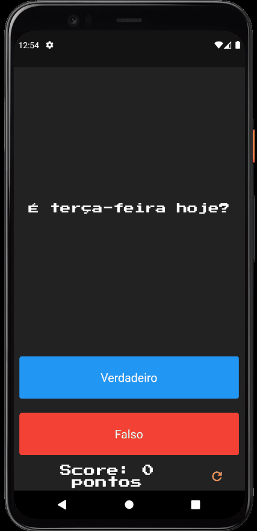

# Quizzler App - [](https://flutter.dev/)

<h1 align="center">
  <p>❓A simple Quiz App❓</p>
  
</h1>

# Features

- Single page with a question to answer 'true' or 'false'
- Score control for each right answer
- Reset button to start again quiz

## Getting Started

- Clone the repository
- run in cmd:
  ```cmd
  flutter pub get
  flutter run
  ```

## Dependencieis

| Lib               | Link                                                                                 |
| ----------------- | ------------------------------------------------------------------------------------ |
| PressStart2P Font | [Google font](https://fonts.google.com/specimen/Press+Start+2P?query=Press+Start+2P) |

## Device

- Tested in Pixel 4 - Android 11
